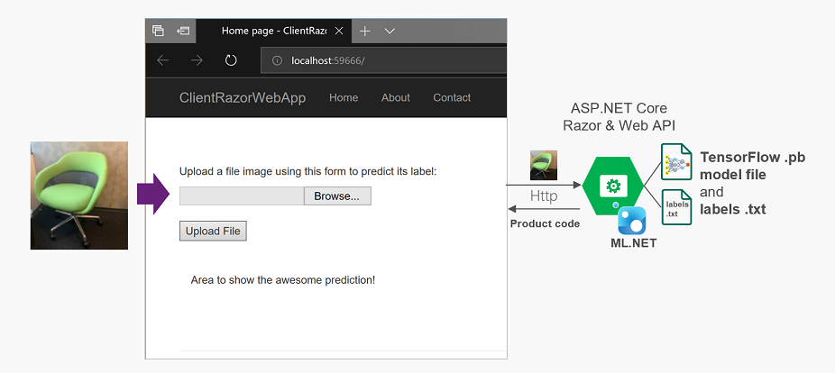

# 图像分类-Asp.Net Core Web/服务示例

| ML.NET 版本 | API 类型          | 状态                        | 应用程序类型    | 数据类型 | 场景            | 机器学习任务                   | 算法                  |
|----------------|-------------------|-------------------------------|-------------|-----------|---------------------|---------------------------|-----------------------------|
| v1.4           | 动态 API | 最新版 | 控制台应用程序 | 图像和文本标签 | 图像分类 | TensorFlow 模型  | 深度学习模型 |

## 问题
这个问题是如何在使用内存图像时在web应用程序/服务中运行/评分TensorFlow模型。

## 解决方案
这个模型（`model.pb`）是用博客[使用ML.NET C＃代码运行从Azure认知服务自定义视觉导出的TensorFlow模型](https://devblogs.microsoft.com/cesardelatorre/run-with-ml-net-c-code-a-tensorflow-model-exported-from-azure-cognitive-services-custom-vision/)讨论的TensorFlow来训练的。

请参见下面的体系结构，该体系结构显示了如何在ASP.NET Core Razor web应用程序/服务中运行/评分TensorFlow模型：

[入门示例](https://github.com/dotnet/machinelearning-samples/tree/main/samples/csharp/getting-started/DeepLearning_ImageClassification_TensorFlow)与此端到端示例的区别在于，图像是从**文件**加载到入门示例中的，而图像则从**内存**加载到这个端到端示例中。

**注意:**  此示例使用自定义图像进行训练，它仅预测[TestImages](./TestImages)文件夹中的特定图像。

## 微调自定义模型

如果您使用的是自定义训练的TensorFlow模型并且分数较低，则可能需要[调整输入图像的大小](https://lutzroeder.github.io/netron/)并微调[ImageSettings struct](https://github.com/dotnet/machinelearning-samples/blob/aaa490461b3d313d1dcd828eaf0bf4ced6609a16/samples/csharp/end-to-end-apps/DeepLearning_ImageClassification_TensorFlow/TensorFlowImageClassification/ML/TensorFlowModelConfigurator.cs#L22)中的一些值，例如图像大小（imageHeight和imageWidth）和偏移量（mean）。调整这些值时，请注意它们是如何影响评分的。

如果您对如何满足模型的需求以获得准确的预测有任何疑问。，可以查看博客[使用ML.NET C＃代码运行从Azure认知服务自定义视觉导出的TensorFlow模型](https://devblogs.microsoft.com/cesardelatorre/run-with-ml-net-c-code-a-tensorflow-model-exported-from-azure-cognitive-services-custom-vision/)。
