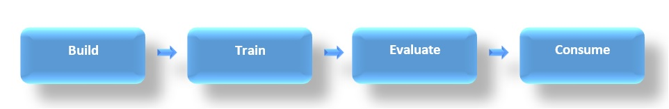

# eShopDashboardML - 销售预测 

| ML.NET 版本 | API 类型          | 状态                        | 应用程序类型    | 数据类型 | 场景            | 机器学习任务                   | 算法                  |
|----------------|-------------------|-------------------------------|-------------|-----------|---------------------|---------------------------|-----------------------------|
| v1.4           | 动态 API | 最新版本 | ASP.NET Core Web应用程序和控制台应用程序 | SQL Server 和 .csv 文件 | 销售预测  | 回归 | FastTreeTweedie Regression, Single Spectrum Analysis |

eShopDashboardML是一个使用[ML.NET](https://github.com/dotnet/machinelearning) 进行（每个产品）销售预测的Web应用程序。

# 概述

这个终端示例应用程序通过展现以下主题着重介绍ML.NET API的用法:

1. 如何训练，建立和生成ML模型
   - 使用.NET Core实现一个[控制台应用程序](https://github.com/feiyun0112/machinelearning-samples.zh-cn/blob/master/samples/csharp/end-to-end-apps/Regression-SalesForecast/src/eShopForecastModelsTrainer)。
2. 如何使用经过训练的ML模型做下个月的销售预测
   - 使用[ASP.NET Core Razor](https://docs.microsoft.com/aspnet/core/tutorials/razor-pages/)实现一个独立的，单体[Web应用程序](https://github.com/feiyun0112/machinelearning-samples.zh-cn/blob/master/samples/csharp/end-to-end-apps/Regression-SalesForecast/src/ShopDashboard)。

该应用程序还使用一个SQL Server数据库存储常规产品目录和订单信息，就像许多使用SQL Server的典型Web应用程序一样。在本例中，由于它是一个示例，因此默认情况下使用localdb SQL数据库，因此不需要设置真正的SQL Server。在第一次运行Web应用程序时，将创建localdb数据库并包含示例数据。

如果要使用真正的SQL Server或Azure SQL数据库，只需更改应用程序中的连接字符串即可。

当你运行应用程序时，它会打开一个网页，上面有一个搜索框，上面写着“输入一个产品”。你可以输入任何产品，例如“瓶子”。然后与关键字“瓶子”相关的产品列表将显示在自动完成建议中。选择任何产品后，该产品的销售预测将显示如下。

这是Web应用程序的一个销售预测屏幕截图示例：


## 设置

了解如何在 Visual Studio 中设置以及对代码的进一步说明：

- [在 Visual Studio 中设置 eShopDashboard 并运行Web应用程序](https://github.com/dotnet/machinelearning-samples/blob/master/samples/csharp/end-to-end-apps/Forecasting-Sales/docs/Setting-up-eShopDashboard-in-Visual-Studio-and-running-it.md)

- [创建和训练您的ML模型](https://github.com/dotnet/machinelearning-samples/blob/master/samples/csharp/end-to-end-apps/Forecasting-Sales/docs/Create-and-train-the-models-%5BOptional%5D.md)
  - 此步骤是可选的，因为Web应用程序已配置为使用预先训练的模型。 但是，您可以创建自己的训练模型，并将预先训练的模型与您自己的模型交换。

## ML.NET代码简介

### 问题

这个问题是基于之前的销售情况围绕产品进行销售预测

### 数据集

为了解决这个问题，您建立了两个独立的ML模型，它们以以下数据集作为输入：

| 数据集 | 列 |
|----------|--------|
| **products stats**  | next, productId, year, month, units, avg, count, max, min, prev      |

[数据集说明](docs/Details-of-Dataset.md) - 转到此链接可获取有关数据集的详细信息。

### ML 任务 - 回归预测与时间序列预测

这个示例显示了可用于预测的两种不同的ML任务和算法：

- **回归** 使用 FastTreeTweedie Regression
- **时间序列** 使用 Single Spectrum Analysis(SSA)

**回归** 是一个有监督的机器学习任务，用于从一组相关的特征/变量预测**下一个**期间的值（在本例中是销售预测）。 **回归** 最适合线性数据。

**Time Series**是一种估算技术，可用于预测未来的**多个**周期。 **时间序列**在涉及非线性数据且趋势难以区分的情况下效果很好。 这是因为“时间序列”使用的SSA算法执行计算以自动识别季节性/周期性模式，同时过滤掉数据中无意义的噪声。 对于“时间序列”模型，重要的是要定期用新观察到的数据点更新模型的状态，以确保执行新的预测时的准确性。 因此，“时间序列”模型是有状态的。

### 解决方案

为了解决这个问题，首先我们将建立ML模型，同时根据现有数据训练每个模型，评估其有多好，最后使用模型预测销售。

请注意，**回归**样本实现了一个模型来预测线性数据。 具体而言，该模型可以预测下一个时期（一个月）的产品需求预测。

**时间序列**样本实现产品在未来**两个**周期（月）的需求预测。**时间序列**样本使用与**回归**样本相同的产品，以便您可以比较两种算法的预测。

在学习/研究样本时，您可以选择专注于回归或时间序列。



#### 加载数据集

**回归**和**时间序列**样本均通过使用**TextLoader**加载数据开始。 要使用**TextLoader**，我们必须指定代表数据模式的类的类型。 我们的类类型为**ProductData**。

```csharp
 public class ProductData
    {
        // The index of column in LoadColumn(int index) should be matched with the position of columns in the underlying data file.
        // The next column is used by the Regression algorithm as the Label (e.g. the value that is being predicted by the Regression model).
        [LoadColumn(0)]
        public float next;

        [LoadColumn(1)]
        public string productId;

        [LoadColumn(2)]
        public float year;

        [LoadColumn(3)]
        public float month;

        [LoadColumn(4)]
        public float units;

        [LoadColumn(5)]
        public float avg;

        [LoadColumn(6)]
        public float count;

        [LoadColumn(7)]
        public float max;

        [LoadColumn(8)]
        public float min;

        [LoadColumn(9)]
        public float prev;
    }
```

将数据集加载到**DataView**中。

```csharp
var trainingDataView = mlContext.Data.LoadFromTextFile<ProductData>(dataPath, hasHeader: true, separatorChar:',');
```

在接下来的步骤中，我们将构建转换管道，指定要使用的训练器/算法，评估模型并测试其预测。 这是[**回归**](#regression)和[**时间序列**](#time-series)示例之间的步骤开始有所不同的地方-本演练的其余部分分别研究了每种算法。

### 回归

#### 1. 回归: 创建管道

此步骤说明如何创建稍后用于构建和训练**回归**模型的管道。

具体来说，我们进行以下转换：

- 连接当前特征生成名为**NumFeatures**的新列
- 使用[独热编码](https://en.wikipedia.org/wiki/One-hot)转换**productId**
- 连接所有生成的特征生成名为**Features**的新列
- 复制**next**列将其重命名为**Label**
- 指定**Fast Tree Tweedie**训练器作为算法应用于模型

在设计管道之后，您可以将数据集加载到DataView中，而且此步骤只是配置，DataView是延迟加载，在下一步训练模型之前数据不会被加载。

[建立模型并训练](./src/eShopForecastModelsTrainer/RegressionTrainer/RegressionModelHelper.cs)

```csharp
var trainer = mlContext.Regression.Trainers.FastTreeTweedie(labelColumnName: "Label", featureColumnName: "Features");

var trainingPipeline = mlContext.Transforms.Concatenate(outputColumnName: "NumFeatures", nameof(ProductData.year), nameof(ProductData.month), nameof(ProductData.units), nameof(ProductData.avg), nameof(ProductData.count), 
    nameof(ProductData.max), nameof(ProductData.min), nameof(ProductData.prev) )
        .Append(mlContext.Transforms.Categorical.OneHotEncoding(outputColumnName: "CatFeatures", inputColumnName: nameof(ProductData.productId)))
        .Append(mlContext.Transforms.Concatenate(outputColumnName: "Features", "NumFeatures", "CatFeatures"))
        .Append(mlContext.Transforms.CopyColumns(outputColumnName: "Label", inputColumnName: nameof(ProductData.next)))
        .Append(trainer);
```

#### 2. 回归: 评估模型

在本例中，**回归**模型的评估是在使用交叉验证方法训练模型之前执行的，因此您将获得指示模型准确度的指标。

```csharp
var crossValidationResults = mlContext.Regression.CrossValidate(data:trainingDataView, estimator:trainingPipeline, numberOfFolds: 6, labelColumnName: "Label");

ConsoleHelper.PrintRegressionFoldsAverageMetrics(trainer.ToString(), crossValidationResults);
```

#### 3. 回归: 训练模型

在建立管道之后，我们通过使用所选算法拟合或使用训练数据来训练预测**回归**模型。 在该步骤中，模型被建立，训练并作为对象返回：

```csharp
var model = trainingPipeline.Fit(trainingDataView);
```

#### 4. 回归: 保存模型

一旦创建和评估了**回归**模型，就可以将它保存到**zip**文件中，任何最终用户的应用程序都可以通过以下代码使用它：

```csharp
using (var file = File.OpenWrite(outputModelPath))
    mlContext.Model.Save(model, trainingDataView.Schema, file);
```

#### 5. 回归: 测试预测

从**zip**文件中加载**回归**模型。

本示例使用产品样本数据的最后一个月来预测下个月的单位销售额。

```csharp
ITransformer trainedModel;
using (var stream = File.OpenRead(outputModelPath))
{
    trainedModel = mlContext.Model.Load(stream,out var modelInputSchema);
}

var predictionEngine = mlContext.Model.CreatePredictionEngine<ProductData, ProductUnitRegressionPrediction>(trainedModel);

Console.WriteLine("** Testing Product **");

// Predict the nextperiod/month forecast to the one provided
ProductUnitRegressionPrediction prediction = predictionEngine.Predict(SampleProductData.MonthlyData[0]);
Console.WriteLine($"Product: {SampleProductData.MonthlyData[0].productId}, month: {SampleProductData.MonthlyData[0].month + 1}, year: {SampleProductData.MonthlyData[0].year} - Real value (units): {SampleProductData.MonthlyData[0].next}, Forecast Prediction (units): {prediction.Score}");

// Predicts the nextperiod/month forecast to the one provided
prediction = predictionEngine.Predict(SampleProductData.MonthlyData[1]);
Console.WriteLine($"Product: {SampleProductData.MonthlyData[1].productId}, month: {SampleProductData.MonthlyData[1].month + 1}, year: {SampleProductData.MonthlyData[1].year} - Forecast Prediction (units): {prediction.Score}");
```

### 时间序列

#### 1. 时间序列: 创建管道

此步骤说明如何创建稍后用于训练**时间序列**模型的管道。

具体来说，**Single Spectrum Analysis (SSA)**训练器是所使用的算法。 进一步阅读以了解该算法所需的参数。 请务必注意，ML.NET对**windowSize**, **seriesLength**, and **trainsize**进行了约束:
- **windowSize** 必须至少为2。
- **trainSize** 必须大于窗口大小的两倍。
- **seriesLength** 必须大于窗口大小。

以下是参数的说明：

- **outputColumnName**: 这是将用于存储预测的列的名称。列必须是**single**类型的向量。在后面的步骤中，我们定义了一个名为**ProductUnitTimeSeriesPrediction**的类，该类包含此输出列。
- **inputColumnName**: 这是要预测的列的名称。该列包含时间序列中数据点的值，并且必须是**single**类型。在我们的示例中，我们正在预测产品的**数量**。
- **windowSize**:  这是最重要的参数，可用于调整方案的模型准确性。具体来说，此参数用于定义时间窗口，算法使用该时间窗口将时间序列数据分解为季节性/周期性和噪声分量。通常，应该从代表您的方案的季节性/周期性业务周期的最大窗口大小开始。例如，如果已知业务周期具有周和月（例如30天）两个季节性/区间，并且每天收集一次数据，则在这种情况下的窗口大小应为30，以表示商业周期中存在的最大时间窗口。如果相同的数据还显示出年度季节性/区间（例如365天），但是使用模型的场景对**年度**季节/区间不感兴趣，则窗口大小**不**需要为365。在此示例中，产品数据基于12个月的周期（每月收集一次数据），因此使用的窗口大小为12。在此示例中，产品数据基于12个月的周期（每月收集一次数据），因此使用的窗口大小为12。
- **seriesLength**: 此参数指定执行预测时使用的数据点数。 
- **trainSize**: 此参数从开始就指定输入时间序列中的数据点总数。请注意，创建模型后，可以保存该模型并使用收集的新数据点进行更新。
- **horizon**: 此参数指示要预测的时段数。在此示例中，我们指定2表示将预测未来2个月的产品数量。
- **confidenceLevel**: 此参数表示实际观测值落在指定间隔范围内的可能性。通常，.95是可接受的起点-该值应介于[0, 1)之间。通常，置信水平越高，区间界限的范围就越广。反之，置信水平越低，区间界限越窄。
- **confidenceLowerBoundColumn**: 这是用于存储每个预测值的**下限**置信区间的列的名称。**ProductUnitTimeSeriesPrediction**类也包含此输出列。
- **confidenceUpperBoundColumn**: 这是将用于存储每个预测值的**上限**置信区间的列的名称。**ProductUnitTimeSeriesPrediction**类也包含此输出列。

具体来说，我们在管道中增加了以下训练器：

```csharp
// Create and add the forecast estimator to the pipeline.
IEstimator<ITransformer> forecastEstimator = mlContext.Forecasting.ForecastBySsa(
    outputColumnName: nameof(ProductUnitTimeSeriesPrediction.ForecastedProductUnits),
    inputColumnName: nameof(ProductData.units),
    windowSize: 12,
    seriesLength: productDataSeriesLength,
    trainSize: productDataSeriesLength,
    horizon: 2,
    confidenceLevel: 0.95f,
    confidenceLowerBoundColumn: nameof(ProductUnitTimeSeriesPrediction.ConfidenceLowerBound),
    confidenceUpperBoundColumn: nameof(ProductUnitTimeSeriesPrediction.ConfidenceUpperBound));
```

#### 2. 时间序列: 拟合模型

在拟合**时间序列**模型之前，我们首先必须筛选加载的数据集，以选择将用于预测销售的特定产品的数据序列。

```csharp
var productId = 988;
IDataView productDataView = mlContext.Data.FilterRowsByColumn(allProductsDataView, nameof(ProductData.productId), productId, productId + 1);
```

接下来，我们将模型拟合到指定产品的数据系列。

```csharp
// Fit the forecasting model to the specified product's data series.
ITransformer forecastTransformer = forecastEstimator.Fit(productDataView);
```

#### 3. 时间序列: 创建模型的检查点

要保存模型，我们首先必须创建**TimeSeriesPredictionEngine**，它既用于获取预测，又用于保存模型。**时间序列**模型使用**CheckPoint**方法保存，该方法将模型保存到**.zip**文件中，任何最终用户应用程序都可以使用该文件。您可能会注意到，这与上面的**回归**示例不同，后者使用**Save**方法保存模型。**时间序列**之所以不同，因为它要求在进行预测时，用新的观测值不断更新模型的状态。因此，**CheckPoint**方法的存在是为了重复更新和保存模型状态。这将在本示例的后续步骤中进一步详细说明。现在，请记住**检查点**是用来保存和更新**时间序列**模型的。

```csharp
// Create the forecast engine used for creating predictions.
TimeSeriesPredictionEngine<ProductData, ProductUnitTimeSeriesPrediction> forecastEngine = forecastTransformer.CreateTimeSeriesEngine<ProductData, ProductUnitTimeSeriesPrediction>(mlContext);

// Save the forecasting model so that it can be loaded within an end-user app.
forecastEngine.CheckPoint(mlContext, outputModelPath);
```

#### 4. 时间序列: 测试预测

要获得预测，请从**zip**文件加载**时间序列**模型，并创建新的**TimeSeriesPredictionEngine**。在这之后，我们可以得到一个预测。

```csharp
// Load the forecast engine that has been previously saved.
ITransformer forecaster;
using (var file = File.OpenRead(outputModelPath))
{
    forecaster = mlContext.Model.Load(file, out DataViewSchema schema);
}

// We must create a new prediction engine from the persisted model.
TimeSeriesPredictionEngine<ProductData, ProductUnitTimeSeriesPrediction> forecastEngine = forecastTransformer.CreateTimeSeriesEngine<ProductData, ProductUnitTimeSeriesPrediction>(mlContext); forecastEngine = forecaster.CreateTimeSeriesEngine<ProductData, ProductUnitTimeSeriesPrediction>(mlContext);

ProductUnitTimeSeriesPrediction originalSalesPrediction = forecastEngine.Predict();
```

创建**TimeSeriesPredictionEngine**时指定的**ProductUnitTimeSeriesPrediction**类型用于存储预测结果：

```csharp
   public class ProductUnitTimeSeriesPrediction
    {
        public float[] ForecastedProductUnits { get; set; }

        public float[] ConfidenceLowerBound { get; set; }

        public float[] ConfidenceUpperBound { get; set; }
    }
```

记住，当我们使用**ForecastBySsa**方法创建SSA Forecasting Trainer时，我们提供了以下参数值：

- **horizon**: 2
- **confidenceLevel**: .95f

因此，当我们使用加载的模型调用**Predict**方法时，**ForecastedProductUnits**向量将包含**两个**预测值。同样，**ConfidenceLowerBound**和**ConfidenceUpperBound**向量将分别包含基于指定的**confidenceLevel**的**两个**值。

您可能注意到**Predict**方法有几个重载，它们接受以下参数：

- **horizon**：允许您在每次进行预测时为**horizon**指定新值。
- **confidenceLevel**：允许您在每次进行预测时为**horizon**指定新值。
- **ProductData example**：用于通过**example**参数传入时间序列的新观测**ProductData**数据点。记住，当用新的观察到的**ProductData**值调用**Predict**时，这将使用时间序列中的这些数据点更新模型状态。然后需要通过调用**CheckPoint**方法将更新后的模型保存到磁盘。

这在我们的示例中也可以看到：

```csharp
ProductUnitTimeSeriesPrediction updatedSalesPrediction = forecastEngine.Predict(newProductData, horizon: 1);

 // Save the updated forecasting model.
 forecastEngine.CheckPoint(mlContext, outputModelPath);
```

// TODO: 为了衡量模型的准确性，我们需要将实际观测值与预测值进行比较。参考以下issue：https://github.com/dotnet/machinelearning/issues/4184.

## 引用

eShopDashboardML数据集是基于**UCI**(http://archive.ics.uci.edu/ml/datasets/online+retail) 的一个公共在线零售数据集
> Daqing Chen, Sai Liang Sain, 和 Kun Guo, 在线零售业的数据挖掘: 基于RFM模型的数据挖掘客户细分案例研究, 数据库营销与客户战略管理杂志, Vol. 19, No. 3, pp. 197–208, 2012 (印刷前在线发布: 27 August 2012. doi: 10.1057/dbm.2012.17).
