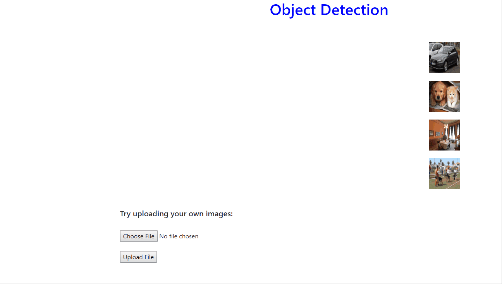
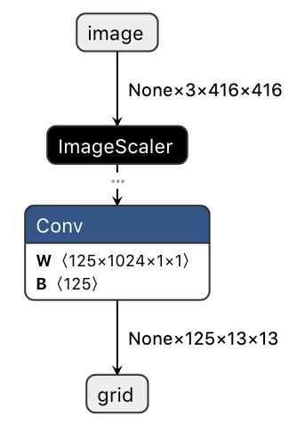

# 对象检测-ASP.NET Core Web和WPF桌面示例

| ML.NET 版本 | API 类型          | 状态                        | 应用程序类型    | 数据类型 | 场景            | 机器学习任务                   | 算法                  |
|----------------|-------------------|-------------------------------|-------------|-----------|---------------------|---------------------------|-----------------------------|
| v1.6.0         | 动态API | 最新 | 端到端应用 | 图像文件 | 对象检测 | 深度学习 | ONNX: Tiny YOLOv2 & Custom Vision |

## 问题

对象检测是计算机视觉中的经典问题之一：识别给定图像中包含哪些对象以及它们在图像中的位置。 对于这些情况，您可以使用预先训练的模型，也可以训练自己的模型对自定义域特定的图像进行分类。 默认情况下，此示例使用预先训练的模型，但是您也可以添加从[Custom Vision](https://www.customvision.a)导出的模型。

## 示例的工作原理

此示例由两个独立的应用程序组成:

- 一个**WPF Core 桌面应用程序**呈现摄像头的实时流，使用ML.NET通过对象检测模型运行视频帧，并用标签绘制边界框，指示实时检测到的对象。
- 一个允许用户上载或选择图像的**ASP.NET Core Web应用**。Web应用程序使用ML.NET通过一个对象检测模型运行图像，并用指示检测到的对象的标签绘制边界框。

Web应用程序显示右侧列出的图像，可以选择每个图像进行处理。一旦图像被处理，它将被绘制在屏幕的中间，每个检测到的对象周围都有标记的边界框，如下所示。


或者，您可以尝试上传自己的图片，如下所示。



## ONNX

开放式神经网络交换即[ONNX](http://onnx.ai/)是一种表示深度学习模型的开放格式。使用ONNX，开发人员可以在最先进的工具之间移动模型，并选择最适合他们的组合。ONNX是由包括微软在内的众多合作伙伴共同开发和支持的。

## 预训练模型

有多个预先训练的模型用于识别图像中的多个对象。**WPF app**和**Web app**都默认使用从[ONNX Model Zoo](https://github.com/onnx/models/tree/master/vision/object_detection_segmentation/tiny_yolov2)下载的预先训练好的模型**Tiny YOLOv2**; 一组经过预先训练的、最先进的ONNX格式模型。**Tiny YOLOv2**是一种用于目标检测的实时神经网络，用于检测[20个不同的类](./OnnxObjectDetection/ML/DataModels/TinyYoloModel.cs#L10-L6)，并在[Pascal VOC](http://host.robots.ox.ac.uk/pascal/VOC/)数据集上进行训练。它由9个卷积层和6个最大池层组成，是更复杂的完整的[YOLOv2](https://pjreddie.com/darknet/yolov2/)网络的较小版本。

## Custom Vision 模型

此示例默认使用上述预先训练的Tiny YOLOv2模型。不过，它也支持从微软[Custom Vision](https://www.customvision.ai)导出的ONNX模型。

### 要使用自己的模型，请使用以下步骤

1. 使用 Custom Vision [创建和训练](https://docs.microsoft.com/en-us/azure/cognitive-services/custom-vision-service/get-started-build-detector)物体探测器。要导出模型，请确保选择一个**紧凑**域，例如**常规（紧凑）**。 要导出现有的对象检测器，请通过选择右上角的齿轮图标将域转换为紧凑型。 在_ **设置** _中，选择一个紧凑的模型，保存并训练您的项目。
2. 转到_**性能**_选项卡[导出模型](https://docs.microsoft.com/azure/cognitive-services/custom-vision-service/export-your-model)。选择一个用紧凑域训练的迭代，将出现一个“导出”按钮。选择_导出_、_ONNX_、_ONNX1.2_，然后选择导出。文件准备好后，选择“下载”按钮。
3. 导出的是一个包含多个文件的zip文件，包括一些示例代码、标签列表和ONNX模型。将.zip文件放到[OnnxObjectDetection](./OnnxObjectDetection)项目中的[**OnnxModels**](./OnnxObjectDetection/ML/OnnxModels)文件夹中。
4. 在解决方案资源管理器中，右键单击[OnnxModels](./OnnxObjectDetection/ML/OnnxModels)文件夹，然后选择_添加现有项_。选择刚添加的.zip文件。
5. 在解决方案资源管理器中，从[OnnxModels](./OnnxObjectDetection/ML/OnnxModels)文件夹中选择.zip文件。更改文件的以下属性：
    - _生成操作 -> 内容_
    - _复制到输出目录 -> 如果较新则复制_

现在，当你生成和运行应用程序时，它将使用你的模型而不是Tiny YOLOv2模型。

## 模型输入和输出

为了解析ONNL模型的预测输出，我们需要了解输入和输出张量的格式（或形状）。为此，我们将首先使用[Netron](https://lutzroeder.github.io/netron/)，一个用于神经网络和机器学习模型的GUI可视化工具，用于检查模型。

下面是一个例子，我们将看到使用Netron打开这个示例的Tiny YOLOv2模型：



从上面的输出中，我们可以看到Tiny YOLOv2模型具有以下输入/输出格式：

### 输入: 'image' 3x416x416

首先要注意的是，**输入张量的名称**是**'image'**。稍后在定义评估管道的**input**参数时，我们将需要这个名称。

我们还可以看到，**输入张量的形状**是**3x416x416**。这说明传入模型的位图图像应该是416高x 416宽。“3”表示图像应为BGR格式；前3个“通道”分别是蓝色、绿色和红色。

### 输出: 'data' 125x13x13

与输入张量一样，我们可以看到**输出名称**是**'data'**。同样，在定义评估管道的**output**参数时，我们会注意到这一点。

我们还可以看到， **输出张量的形状**是**125x13x13**。

125x13x13的“13x13”部分意味着图像被分成一个13x13的“单元格”网格（13列x 13行）。因为我们知道输入图像是416x416，所以我们可以推断出每个“单元”都是32高x 32宽（416/13=32）

```
   ├──────────────── 416 ─────────────────┤
   ┌──┬──┬──┬──┬──┬──┬──┬──┬──┬──┬──┬──┬──┐ ┬     416/13=32
   ├──┼──┼──┼──┼──┼──┼──┼──┼──┼──┼──┼──┼──┤ │          ┌──┐
   ├──┼──┼──┼──┼──┼──┼──┼──┼──┼──┼──┼──┼──┤ │          └──┘
   ├──┼──┼──┼──┼──┼──┼──┼──┼──┼──┼──┼──┼──┤ │         32x32
   ├──┼──┼──┼──┼──┼──┼──┼──┼──┼──┼──┼──┼──┤ │
   ├──┼──┼──┼──┼──┼──┼──┼──┼──┼──┼──┼──┼──┤ │
13 ├──┼──┼──┼──┼──┼──┼──┼──┼──┼──┼──┼──┼──┤ │
   ├──┼──┼──┼──┼──┼──┼──┼──┼──┼──┼──┼──┼──┤ 416
   ├──┼──┼──┼──┼──┼──┼──┼──┼──┼──┼──┼──┼──┤ │
   ├──┼──┼──┼──┼──┼──┼──┼──┼──┼──┼──┼──┼──┤ │
   ├──┼──┼──┼──┼──┼──┼──┼──┼──┼──┼──┼──┼──┤ │
   ├──┼──┼──┼──┼──┼──┼──┼──┼──┼──┼──┼──┼──┤ │
   ├──┼──┼──┼──┼──┼──┼──┼──┼──┼──┼──┼──┼──┤ │
   └──┴──┴──┴──┴──┴──┴──┴──┴──┴──┴──┴──┴──┘ ┴
                      13
```

那125呢？ “125”告诉我们，对于每个网格单元，模型返回125个“通道”（或数据）作为该单个单元的预测输出。

要了解为什么有125个通道，我们首先需要了解该模型不能预测对象的任意边界框。 相反，每个单元格负责预测5个预定的边界框。 这5个框是根据以下每个`anchor` 框的偏移量计算得出的：

```
┌───────────────────┐
│       ┌───┐       │
│ ┌─────┼───┼─────┐ │
│ │  ┌──┼───┼──┐  │ │
│ │  │  │┌─┐│  │  │ │
│ │  │  │└─┘│  │  │ │
│ │  └──┼───┼──┘  │ │
│ └─────┼───┼─────┘ │
│       └───┘       │
└───────────────────┘
```

因此，对于每个单独的单元格，该模型返回5个预测（每个锚定一个，由上面的框形表示），每个预测包括以下25个参数：

- 4个参数指示边界框的位置（x，y，宽度，高度）
- 1个参数指示盒子的置信度得分（或客观性）
- 20个类别的概率（每个类别一个概率分数，表明该对象是该类别的可能性）

5个盒子x 25个参数= 125个'通道'

_注意，如果对模型进行训练以检测不同数量的类，则该值将不同。例如，仅能检测3个不同类的模型的输出格式为40x13x13：_

- _（x，y，宽度，高度，客观性）+ 3个类别概率= 8个参数_
- _5个盒子 x 8个参数 = 40个'通道'_

## 解决方案

**此解决方案中的项目使用.NET Core 3.0。 为了运行此示例，您必须安装.NET Core SDK 3.0。 为此，请执行以下任一操作：**

1. 通过转到[.NET Core 3.0下载页面](https://aka.ms/netcore3download)手动安装SDK，并在“SDK”列中下载最新的“.NET Core安装程序”。
2. 或者，如果您使用的是Visual Studio 2019，请转至：_ **工具>选项>环境>预览功能** _，然后选中以下复选框：_ **使用.NET Core SDK的预览**

### 解决方案包含三个项目

- [**OnnxObjectDetection**](./OnnxObjectDetection)是WPF应用程序和Web应用程序都使用的.NET Standard库。 它包含用于通过模型运行图像并解析结果预测的大多数逻辑。 该项目还包含ONNX模型文件。 除了在图像/屏幕上绘制标签边界框之外，此项目包含下面的所有代码段。
- [**OnnxObjectDetectionWeb**](./OnnxObjectDetectionWeb) 包含一个ASP.NET Core Web App，其中包含**Razor UI页面**和**API controller**以处理和呈现图像。
- [**OnnxObjectDetectionApp**](./OnnxObjectDetectionApp) 包含一个.NET CORE WPF桌面应用程序，该应用程序使用[OpenCvSharp](https://github.com/shimat/opencvsharp)从设备的网络摄像头捕获视频。

## 代码演练

_该示例与[getting-started object detection sample](https://github.com/dotnet/machinelearning-samples/tree/main/samples/csharp/getting-started/DeepLearning_ObjectDetection_Onnx)不同，在这里我们加载/处理在内存中的图像**，而入门示例从**文件**中加载图像。_

创建一个类，该类定义将数据加载到IDataView中时要使用的数据模式。 ML.NET支持图像的`Bitmap`类型，因此我们将指定以`ImageTypeAttribute`修饰的`Bitmap`属性，并传入通过[检查模型]](#model-input-and-output)得到的高度和宽度尺寸，如下所示。

```csharp
public struct ImageSettings
{
    public const int imageHeight = 416;
    public const int imageWidth = 416;
}

public class ImageInputData
{
    [ImageType(ImageSettings.imageHeight, ImageSettings.imageWidth)]
    public Bitmap Image { get; set; }
}
```

### ML.NET: 配置模型

第一步是创建一个空的`DataView`，以获取配置模型时要使用的数据架构。

```csharp
var dataView = _mlContext.Data.LoadFromEnumerable(new List<ImageInputData>());
```

第二步是定义评估器管道。通常在处理深度神经网络时，必须使图像适应网络所期望的格式。因此，下面的代码将调整图像的大小并对其进行变换（所有R、G、B通道的像素值都已标准化）。

```csharp
var pipeline = mlContext.Transforms.ResizeImages(resizing: ImageResizingEstimator.ResizingKind.Fill, outputColumnName: onnxModel.ModelInput, imageWidth: ImageSettings.imageWidth, imageHeight: ImageSettings.imageHeight, inputColumnName: nameof(ImageInputData.Image))
                .Append(mlContext.Transforms.ExtractPixels(outputColumnName: onnxModel.ModelInput))
                .Append(mlContext.Transforms.ApplyOnnxModel(modelFile: onnxModel.ModelPath, outputColumnName: onnxModel.ModelOutput, inputColumnName: onnxModel.ModelInput));
```

接下来，我们将使用通过[检查模型](#model-input-and-output) 得到的输入和输出张量名称来定义Tiny YOLOv2 Onnx模型的**input**和**output**参数。

```csharp
public struct TinyYoloModelSettings
{
    public const string ModelInput = "image";
    public const string ModelOutput = "grid";
}
```

最后，通过拟合“DataView”来创建模型。

```csharp
var model = pipeline.Fit(dataView);
```

## 加载模型并创建PredictionEngine

配置模型后，我们需要保存模型，加载保存的模型，创建一个`PredictionEngine`，然后将图像传递给引擎以使用模型检测对象。这是一个**Web**应用程序和**WPF**应用程序略有不同的地方。

**Web**应用程序使用一个`PredictionEnginePool`来高效地管理服务，并为服务提供一个`PredictionEngine`来进行预测。在内部，它进行了优化，以便在创建这些对象时，以最小的开销在Http请求之间缓存和共享对象依赖关系。

```csharp
public ObjectDetectionService(PredictionEnginePool<ImageInputData, TinyYoloPrediction> predictionEngine)
{
    this.predictionEngine = predictionEngine;
}
```

而**WPF**桌面应用程序创建一个`PredictionEngine`，并在本地缓存以用于每个帧预测。需要澄清的关键点是，实例化`PredictionEngine`的调用代码负责处理缓存（与`PredictionEnginePool`相比）。

```csharp
public PredictionEngine<ImageInputData, TinyYoloPrediction> GetMlNetPredictionEngine()
{
    return mlModel.Model.CreatePredictionEngine<ImageInputData, TinyYoloPrediction>(mlModel);
}
```

## 检测图像中的对象

获取预测时，我们在`PredictedLabels`属性中得到一个大小为**21125**的 `float`数组。这是[前面讨论过的](#output-data-125x13x13)模型的125x13x13输出。然后，我们使用[`OnnxOutputParser`](./OnnxObjectDetection/OnnxOutputParser.cs)类解释并返回每个图像的多个边界框。同样，这些框被过滤，因此我们只检索到5个具有高置信度的框。

```csharp
var labels = tinyYoloPredictionEngine?.Predict(imageInputData).PredictedLabels;
var boundingBoxes = outputParser.ParseOutputs(labels);
var filteredBoxes = outputParser.FilterBoundingBoxes(boundingBoxes, 5, 0.5f);
```

## 在图像中检测到的对象周围绘制边界框

最后一步是在对象周围绘制边界框。

**Web**应用程序使用Paint API将框直接绘制到图像上，并返回图像以在浏览器中显示。
```csharp
var img = _objectDetectionService.DrawBoundingBox(imageFilePath);

using (MemoryStream m = new MemoryStream())
{
   img.Save(m, img.RawFormat);
   byte[] imageBytes = m.ToArray();

   // Convert byte[] to Base64 String
   base64String = Convert.ToBase64String(imageBytes);
   var result = new Result { imageString = base64String };
   return result;
}
```

另外，**WPF**应用程序在与流式视频播放重叠的[`Canvas`](https://docs.microsoft.com/en-us/dotnet/api/system.windows.controls.canvas?view=netcore-3.0) 元素上绘制边界框。

```csharp
DrawOverlays(filteredBoxes, WebCamImage.ActualHeight, WebCamImage.ActualWidth);

WebCamCanvas.Children.Clear();

foreach (var box in filteredBoxes)
{
    var objBox = new Rectangle {/* ... */ };

    var objDescription = new TextBlock {/* ... */ };

    var objDescriptionBackground = new Rectangle {/* ... */ };

    WebCamCanvas.Children.Add(objDescriptionBackground);
    WebCamCanvas.Children.Add(objDescription);
    WebCamCanvas.Children.Add(objBox);
}
```

## 关于准确性的说明

Tiny YOLOv2的精确度明显低于完整的YOLOv2模型，但是对于这个示例应用程序来说，Tiny版本已经足够了。

## 疑难解答（Web应用程序）

通过应用程序服务在Azure上部署此应用程序时，您可能会遇到一些常见问题。

1. 应用程序返回5xx代码


    1. 部署应用程序后，您可能会得到5xx代码的一个原因是平台。web应用程序仅在64位体系结构上运行。在Azure中，更改**设置>配置>常规设置**菜单中相应应用程序服务中的**平台**设置。

    1. 部署应用程序后使用5xx代码的另一个原因是web应用程序的目标框架是.NET Core 3.0，它目前正在预览中。您可以将应用程序和引用的项目还原为.NET Core 2.x或向应用程序服务添加扩展。

        - 要在Azure门户中添加.NET Core 3.0支持，请选择相应应用程序服务的**开发工具>扩展**部分中的**添加**按钮。
        - 然后，从扩展列表中选择**选择扩展**并选择**ASP.NET Core 3.0（x64）Runtime**并接受法律条款，继续将扩展添加到应用程序服务。

1. 相对路径

    在本地和Azure上工作时，路径的工作方式略有不同。如果成功地部署了应用程序，但单击其中一个预加载的映像或上载自己的映像不起作用，请尝试更改相对路径。为此，在*Controllers/ObjectDetectionController.cs*文件中，更改构造函数中的`_imagesTmpFolder`的值。

    ```csharp
    _imagesTmpFolder = CommonHelpers.GetAbsolutePath(@"ImagesTemp");
    ```

    对`Get`操作中的`imageFileRelativePath`执行相同的操作。

    ```csharp
    string imageFileRelativePath = @"assets" + url;
    ```

    或者，您可以根据环境（dev / prod）设置条件，是使用路径的本地版本还是Azure首选的版本。
