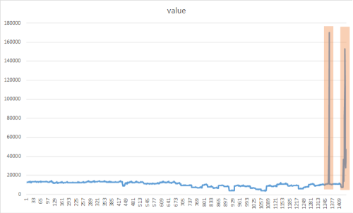

# 产品销售的峰值检测和变化点检测

| ML.NET 版本 | API 类型          | 状态                        | 应用程序类型    | 数据类型 | 场景            | 机器学习任务                   | 算法                  |
|----------------|-------------------|-------------------------------|-------------|-----------|---------------------|---------------------------|-----------------------------|
| v1.4         | 动态 API | 最新版 | 控制台应用程序 | .csv 文件 | 产品销售峰值检测| 时间序列 - 异常检测| IID Spike Detection and IID Change point Detection |

在这个介绍性示例中，您将看到如何在产品销售中使用[ML.NET](https://www.microsoft.com/net/learn/apps/machine-learning-and-ai/ml-dotnet)来检测**峰值**和**变化点**。在机器学习的世界中，这种类型的任务被称为时间序列异常检测。

## 问题
我们有超过3个月的产品销售数据，在这段时间内，产品的销售是高和正常的。我们识别产品销售的突然高峰，这样我们就可以使用这些高峰数据来分析产品销售的趋势。

为了解决这个问题，我们将使用下列输入构建一个ML模型：
* 日期
* 超过3个月的产品销售

并预测产品销售的峰值和变化点。

## 数据集
我们已经为产品销售创建了示例数据集。可以在[这里](./SpikeDetection/Data/product-sales.csv)找到数据集`product-sales.csv`

**产品销售数据集**的格式如下。

| Month  | ProductSales |
|--------|--------------|
| 1-Jan  | 271          |
| 2-Jan  | 150.9        |
| .....  | .....        |
| 1-Feb  | 199.3        |
| ...    | ....         |

产品销售数据集中的数据格式引用自**洗发水销售数据集**，洗发水销售数据集的许可证在[这里](./SpikeDetection/Data/SHAMPOO-SALES-LICENSE.txt)。

算法**IID Spike Detection**或**IID Change point Detection**适合于**独立和同分布的**。在概率论和数理统计中，如果每个随机变量具有相同的概率分布，并且它们彼此独立，则随机变量的集合是独立同分布的（IID）。更多信息可在维基百科[这里](https://en.wikipedia.org/wiki/Independent_and_identically_distributed_random_variables)获得

## ML 任务 - 时间序列异常检测
异常检测是在数据中检测异常值的过程。时间序列的异常检测是指在给定的输入时间序列上检测时间戳或点，在该时间序列中，时间序列的行为与预期的不同。这些偏差通常表示问题域中的一些感兴趣的事件：对用户帐户的网络攻击、断电、服务器上的突发RPS、内存泄漏等。

另一方面，异常行为可以是持续的，也可以是暂时的突发。在这种情况下，有2种类型的异常：归因于临时爆发的**峰值**和表明系统的持续变化开始的**变化点**。

## 峰值检测
峰值是由于输入时间序列的值突然而暂时的爆发。在实践中，它们可能由于各种原因而发生，这取决于应用程序：中断、网络攻击、病毒Web内容等。因此，在许多应用中，检测峰值是很重要的。



## 变化点检测
​变化点标志着时间序列中从预期开始的行为的持续偏差。在实践中，这些时间序列行为的变化通常是由系统动力学的一些基本变化触发的。例如，在系统遥测监视中，在一定时间点之后，存储器泄漏的引入可导致存储器使用时间序列中的（慢）趋势。


## 解决方案
要解决此问题，您需要在现有训练数据上构建和训练ML模型，评估其有多好（分析获得的指标），最后您可以使用/测试模型来预测给定输入数据变量的需求。


然而，在这个例子中，我们将建立和训练模型来演示时间序列异常检测库，因为它使用实际数据检测，并且没有评估方法。然后，我们将在预测输出列中查看检测到的异常。

构建和训练模型的过程对于峰值检测和变化点检测是相同的；主要区别是您使用的算法(DetectIidSpike vs. DetectIidChangePoint)。

### 1. 建立模型

建立模型包括：

* 创建只包含数据集架构的空IDataView。

* 通过应用转换器创建一个估算器（例如`IidSpikeDetector`或`IidChangePointDetector`）并设置参数（在这个例子中是置信水平和p值）。

峰值检测的初始代码类似于以下代码：

```CSharp
CreateEmptyDataView();

//Create ML Context object
MLContext mlcontext = new MLContext();

//STEP 1: Create Esimtator   
var estimator = mlContext.Transforms.DetectIidSpike(outputColumnName: nameof(ProductSalesPrediction.Prediction), inputColumnName: nameof(ProductSalesData.numSales), confidence: 95, pvalueHistoryLength: size / 4);

```

### 2. 转换模型
注意，在IID峰值检测或IID变化点检测中，我们不需要进行训练，只需要进行转换。由于您不是在训练模型，所以不需要用实际数据加载IDataView，只需要数据的架构。因此，通过传递**空的IDataView对象**，使用`Fit()`API创建模型。

```CSharp
//STEP 2:The Transformed Model.
//In IID Spike detection, we don't need to do training, we just need to do transformation. 
//As you are not training the model, there is no need to load IDataView with real data, you just need schema of data.
//So create empty data view and pass to Fit() method. 
ITransformer tansformedModel = estimator.Fit(CreateEmptyDataView());
```

### 3. 使用模型
* 在时间序列异常检测中，我们没有评估步骤。我们使用转换后的模型来预测数据中的异常。

* 将要预测的数据从（`Product Sales.csv`）加载到IDataView并创建预测。

```CSharp
//Load the data into IDataView.
//This dataset is used for detecting spikes or changes not for training.
IDataView dataView = mlContext.Data.LoadFromTextFile<ProductSalesData>(path: DatasetPath, hasHeader: true, separatorChar: ',');

//Apply data transformation to create predictions.
IDataView transformedData = tansformedModel.Transform(dataView);
var predictions = mlcontext.Data.CreateEnumerable<ProductSalesPrediction>(transformedData, reuseRowObject: false);
          
Console.WriteLine("Alert\tScore\tP-Value");
foreach (var p in predictions)
{
    if (p.Prediction[0] == 1)
    {
        Console.BackgroundColor = ConsoleColor.DarkYellow;
        Console.ForegroundColor = ConsoleColor.Black;
    }
    Console.WriteLine("{0}\t{1:0.00}\t{2:0.00}", p.Prediction[0], p.Prediction[1], p.Prediction[2]);
    Console.ResetColor();
}
    Console.WriteLine("");
}

//sample output
// Prediction column obtained post-transformation.
   // Alert   Score   P-Value   
    //0       122.90  0.13
    //1       336.50  0.00<-- alert is on, predicted spike
    //0       185.90  0.48
    //0       194.30  0.48
    //0       149.50  0.24
    //0       210.10  0.42
    //0       273.30  0.19
    //0       191.40  0.43
    //0       287.00  0.17
    //0       226.00  0.45
    //0       303.60  0.18
    //0       289.90  0.19
    //1       421.60  0.00 <-- alert is on, predicted spike
    //0       264.50  0.47
```

### 变化点检测的控制台输出

```
Alert   Score   P-Value Martingale value
0       266.00  0.50    0.00
0       145.90  0.00    2.33
0       183.10  0.41    2.80
0       119.30  0.13    9.16
0       180.30  0.47    9.77
0       168.50  0.47    10.41
0       231.80  0.19    24.46
0       224.50  0.27    42.38
1       192.80  0.48    44.23  <-- alert is on, predicted changepoint
0       122.90  0.13    145.25
0       336.50  0.00    0.01
0       185.90  0.48    0.01
```
