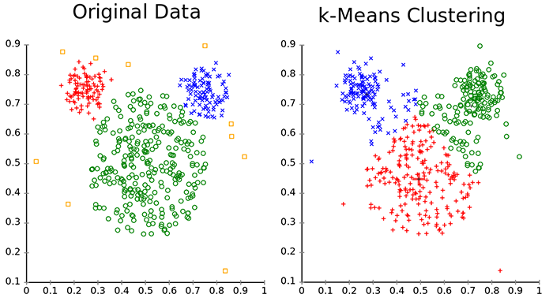
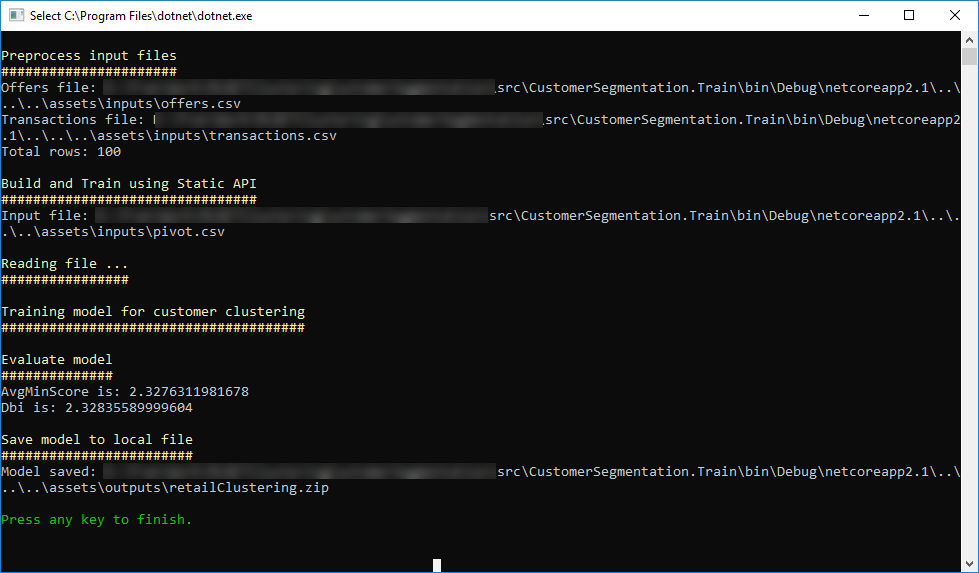
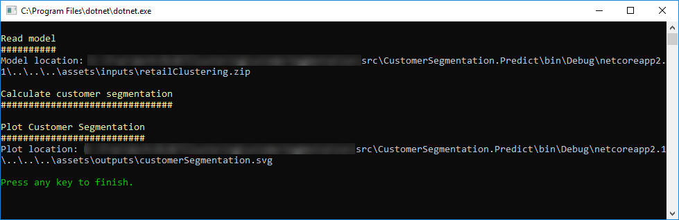
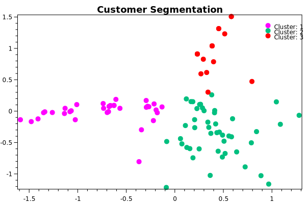

# 客户细分-聚类示例

| ML.NET 版本 | API 类型          | 状态                        | 应用程序类型    | 数据类型 | 场景            | 机器学习任务                   | 算法                  |
|----------------|-------------------|-------------------------------|-------------|-----------|---------------------|---------------------------|-----------------------------|
| v1.4           | 动态 API | 最新版 | 控制台应用程序 | .csv 文件 | 客户细分 | 聚类 | K-means++ |

## 问题

您需要**识别具有相似特征的客户群**，以便以后对他们准确定位（例如每个具有相似特征的已识别客户群进行不同的营销活动，等等）

要解决的问题是，如何在没有任何预先存在的类别列表的情况下，识别具有相似特征和兴趣的不同客户群。你*没有*在一个分类列表中对客户进行分类，因为你的客户没有*被标记*，所以你不能这样做。你只需要建立一个客户群，然后公司以后可以将其用于其他业务目的。

## 数据集

在这个假设的例子中，要处理的数据来自“The Wine Company”。这些数据基本上是公司过去提供的报价/交易（营销活动的一部分）的历史数据，以及客户购买的历史数据。

训练数据集位于`assets/inputs` 文件夹中，并且拆分成两个文件。优惠文件包含有关特定优惠/优惠的过去营销活动的信息：

|Offer #|Campaign|Varietal|Minimum Qty (kg)|Discount (%)|Origin|Past Peak|
|-------|--------|--------|----------------|------------|------|---------|
|1|January|Malbec|72|56|France|FALSE|
|2|January|Pinot Noir|72|17|France|FALSE|
|3|February|Espumante|144|32|Oregon|TRUE|
|4|February|Champagne|72|48|France|TRUE|
|5|February|Cabernet Sauvignon|144|44|New Zealand|TRUE|

交易文件包含有关客户购买的信息（与上述优惠相关）：

|Customer Last Name|Offer #|
|------------------|-------|
|Smith|2|
|Smith|24|
|Johnson|17|
|Johnson|24|
|Johnson|26|
|Williams|18|

该数据集来自John Foreman的书籍[Data Smart]（http://www.john-foreman.com/data-smart-book.html）。

## ML 任务 - [聚类](https://en.wikipedia.org/wiki/Cluster_analysis)

解决此类问题的ML任务称为**聚类**。
 
通过应用ML聚类技术，您将能够识别相似的客户并将他们分组在集群中，而无需预先存在的类别和历史标记/分类数据。聚类是识别一组“相关或类似事物”的好方法，而无需任何预先存在的类别列表。这正是*聚类*和*分类*之间的主要区别。

在当前示例中用于这个任务的算法是*K-Means*。简而言之，该算法将数据集的样本分配给**k**簇：
* *K-Means* 不计算最佳簇数，因此这是一个算法参数
* *K-Means* 最小化每个点与群集的质心（中点）之间的距离
* 属于群集的所有点都具有相似的属性（但这些属性不一定直接映射到用于训练的特征，并且通常是进一步数据分析的目标）

绘制带有集群的图表有助于您直观地确定哪些数量的集群对您的数据更有效，这取决于您能够识别每个集群的隔离程度。一旦确定了集群的数量，就可以用首选名称命名每个集群，并将每个客户群用于任何业务目的。

下图显示了一个集群数据分布的示例，以及k-Means如何重新构建数据集群。



从上图中可以看出，有一个问题是：我们如何在二维空间中绘制由不同特征形成的样本？ 这是一个被称为“降维”的问题：每个样本属于由其每个特征（offer、campaign等）形成的维度空间，因此我们需要一个函数，将观察从前一个空间“转换”到另一个空间（通常 在我们的例子中，只有两个特征：X和Y）。 在这种情况下，我们将使用一种称为PCA的常用技术，但也存在类似的技术，如SVD，可以用于相同的目的。

为了解决这个问题，首先我们将建立一个ML模型。 然后，我们将在现有数据上训练模型，评估它的性能，最后我们将使用该模型将客户分类到集群中。


### 1. 建立模型

#### 数据预处理

首先要做的是将数据合并到单个视图中。 因为我们需要比较用户进行的交易，所以我们将构建一个数据透视表，其中行是客户，列是活动，单元格值显示客户是否在该活动期间进行了相关的交易。

数据透视表是执行PreProcess函数构建的，在本例中，PreProcess函数是通过将文件数据加载到内存中并使用Linq联接数据来实现的。但您可以根据数据的大小使用任何其他方法，例如关系数据库或任何其他方法：

```csharp
// inner join datasets
var clusterData = (from of in offers
                   join tr in transactions on of.OfferId equals tr.OfferId
                   select new
                   {
                       of.OfferId,
                       of.Campaign,
                       of.Discount,
                       tr.LastName,
                       of.LastPeak,
                       of.Minimum,
                       of.Origin,
                       of.Varietal,
                       Count = 1,
                   }).ToArray();

// pivot table (naive way)
var pivotDataArray =
    (from c in clusterData
     group c by c.LastName into gcs
     let lookup = gcs.ToLookup(y => y.OfferId, y => y.Count)
     select new PivotData()
     {
         C1 = (float)lookup["1"].Sum(),
         C2 = (float)lookup["2"].Sum(),
         C3 = (float)lookup["3"].Sum(),
         // ...
      };
```

数据被保存到`pivot.csv`文件中，看起来像下面的表：

|C1|C2|C3|C4|C5|C6|C8|C9|C10|C11|C12|C13|C14|C15|C16|C17|C18|C19|C20|C21|C22|C23|C24|C25|C26|C27|C28|C29|C30|C31|C32|LastName|
|--|--|--|--|--|--|--|--|---|---|---|---|---|---|---|---|---|---|---|---|---|---|---|---|---|---|---|---|---|---|---|--------|
|1|0|0|1|0|0|0|0|1|0|1|0|0|1|0|0|0|0|0|0|0|0|0|0|0|1|0|0|0|0|0|0|Thomas|
|1|1|0|0|0|0|0|0|0|0|1|0|0|0|1|0|0|0|0|0|0|1|0|0|0|0|0|0|0|0|0|0|Jackson|
|1|1|0|0|0|0|0|0|0|0|0|0|0|0|0|0|0|0|0|0|0|0|0|0|0|0|0|0|0|0|0|0|Mitchell|

#### 模型管道

下面是用于建立模型的代码：
```csharp
//Create the MLContext to share across components for deterministic results
MLContext mlContext = new MLContext(seed: 1);  //Seed set to any number so you have a deterministic environment

// STEP 1: Common data loading configuration
var pivotDataView = mlContext.Data.LoadFromTextFile(path: pivotCsv,
                                            columns: new[]
                                                        {
                                                        new TextLoader.Column("Features", DataKind.Single, new[] {new TextLoader.Range(0, 31) }),
                                                        new TextLoader.Column(nameof(PivotData.LastName), DataKind.String, 32)
                                                        },
                                            hasHeader: true,
                                            separatorChar: ',');

// STEP 2: Configure data transformations in pipeline
var dataProcessPipeline = mlContext.Transforms.ProjectToPrincipalComponents(outputColumnName: "PCAFeatures", inputColumnName: "Features", rank: 2)
        .Append(mlContext.Transforms.Categorical.OneHotEncoding(outputColumnName: "LastNameKey", inputColumnName: nameof(PivotData.LastName), OneHotEncodingEstimator.OutputKind.Indicator));
                

// STEP 3: Create the training pipeline                
var trainer = mlContext.Clustering.Trainers.KMeans(featureColumnName: "Features", numberOfClusters: 3);
var trainingPipeline = dataProcessPipeline.Append(trainer);
```

在本例中，`TextLoader`没有显式定义每个列，而是声明由文件的前32列组成的“Features”属性；还将属性“LastName”声明为最后一列的值。

然后，您需要对数据应用一些转换： 

1) 使用`mlContext.Transforms.Projection.ProjectToPrincipalComponents(outputColumnName: "PCAFeatures", inputColumnName: DefaultColumnNames.Features, rank: 2)`添加一个PCA列，参数`rank: 2`意味着我们正在将特征从32维减少到（* x *和* y *）

2) 使用`OneHotEncodingEstimator`转换LastName

3) 添加KMeansPlusPlusTrainer; 与该学习器一起使用的主要参数是`clustersCount`，它指定了簇的数量

### 2. 训练模型
在构建管道之后，我们通过使用所选算法拟合或使用训练数据来训练客户细分模型：
```csharp
ITransformer trainedModel = trainingPipeline.Fit(pivotDataView);
```

### 3. 评估模型
我们评估模型的准确性。 使用[ClusteringEvaluator](#)测量准确度，并显示[Accuracy](https://en.wikipedia.org/wiki/Confusion_matrix)和[AUC](https://loneharoon.wordpress.com/2016/08/17/area-under-the-curve-auc-a-performance-metric/) 指标。

```csharp
var predictions = trainedModel.Transform(pivotDataView);
var metrics = mlContext.Clustering.Evaluate(predictions, scoreColumnName: "Score", featureColumnName: "Features");
```

最后，我们使用动态API将模型保存到本地磁盘：
```csharp
 //STEP 6: Save/persist the trained model to a .ZIP file
using (var fs = new FileStream(modelZip, FileMode.Create, FileAccess.Write, FileShare.Write))
    mlContext.Model.Save(trainedModel, pivotDataView.Schema, fs);
```

#### 运行模型训练

在Visual Studio中打开解决方案后，第一步是创建客户细分模型。 首先将项目`CustomerSegmentation.Train`设置为Visual Studio中的启动项目，然后单击F5。 将打开一个控制台应用程序，它将创建模型（并保存在[assets/output](./src/CustomerSegmentation.Train/assets/outputs/)文件夹中）。 控制台的输出类似于以下屏幕截图：



### 4. 使用模型

在`CustomerSegmentation.Predict`项目中使用在上一步中创建的模型用于项目“CustomerSegmentation.Predict”。 基本上，我们加载模型，然后加载数据文件，最后我们调用Transform来对数据执行模型。

在本例中，模型不是用来预测任何值（例如回归任务）或对任何事物进行分类（例如分类任务），而是基于客户的信息构建可能的集群/组。

下面的代码是如何使用模型创建这些集群：

```csharp
var data = _mlContext.Data.LoadFromTextFile(path:_pivotDataLocation,
                            columns: new[]
                                        {
                                          new TextLoader.Column("Features", DataKind.Single, new[] {new TextLoader.Range(0, 31) }),
                                          new TextLoader.Column(nameof(PivotData.LastName), DataKind.String, 32)
                                        },
                            hasHeader: true,
                            separatorChar: ',');

//Apply data transformation to create predictions/clustering
var tranfomedDataView = _trainedModel.Transform(data);
var predictions = _mlContext.Data.CreateEnumerable <ClusteringPrediction>(tranfomedDataView, false)
                            .ToArray();
```

此外，方法`SaveCustomerSegmentationPlotChart()`使用[OxyPlot](http://www.oxyplot.org/)库保存绘制每个分配集群中的样本的散点图。

#### 运行模型并识别集群

要运行前面的代码，在Visual Studio中将 `CustomerSegmentation.Predict`项目设置为启动项目，然后点击F5。



在执行预测控制台应用程序之后，将生成绘图到assets/output文件夹中，显示集群分布（类似于下图）：



在该图表中，您可以识别出3个集群。 在本例中，其中两个更好地分化（蓝色的簇1和绿色的簇2）。 但是，集群3仅部分区分，部分客户与集群2重叠。
