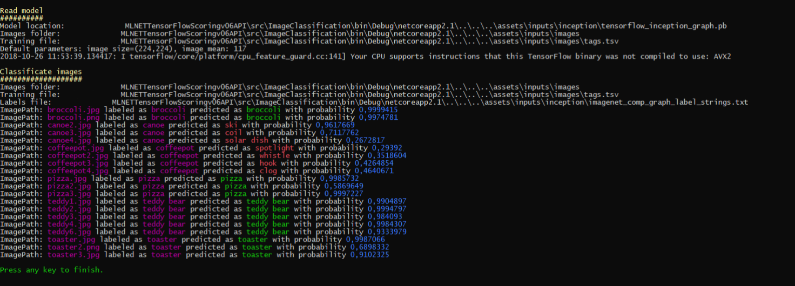

# 图像分类 - 评分示例

| ML.NET 版本 | API 类型          | 状态                        | 应用程序类型    | 数据类型 | 场景            | 机器学习任务                   | 算法                  |
|----------------|-------------------|-------------------------------|-------------|-----------|---------------------|---------------------------|-----------------------------|
| v1.4           | 动态 API | 最新版 | 控制台应用程序 | 图像和文本标签 | 图像分类 | TensorFlow Inception5h | DeepLearning model |

## 问题
图像分类是许多业务场景中的常见情况。 对于这些情况，您可以使用预先训练的模型或训练自己的模型来对特定于自定义域的图像进行分类。

## 数据集
有两个数据源：`tsv`文件和图像文件。[tsv 文件](./ImageClassification/assets/inputs/images/tags.tsv) 包含2列：第一个定义为`ImagePath`，第二个定义为对应于图像的`Label`。正如你所看到的，文件没有标题行，看起来像这样：
```tsv
broccoli.jpg	broccoli
broccoli.png	broccoli
canoe2.jpg	canoe
canoe3.jpg	canoe
canoe4.jpg	canoe
coffeepot.jpg	coffeepot
coffeepot2.jpg	coffeepot
coffeepot3.jpg	coffeepot
coffeepot4.jpg	coffeepot
pizza.jpg	pizza
pizza2.jpg	pizza
pizza3.jpg	pizza
teddy1.jpg	teddy bear
teddy2.jpg	teddy bear
teddy3.jpg	teddy bear
teddy4.jpg	teddy bear
teddy6.jpg	teddy bear
toaster.jpg	toaster
toaster2.png	toaster
toaster3.jpg	toaster
```
训练和测试图像位于assets文件夹中。这些图像属于Wikimedia Commons。
> *[Wikimedia Commons](https://commons.wikimedia.org/w/index.php?title=Main_Page&oldid=313158208), 免费媒体存储库。* 于2018年10月17日10:48检索自:  
> https://commons.wikimedia.org/wiki/Pizza  
> https://commons.wikimedia.org/wiki/Coffee_pot  
> https://commons.wikimedia.org/wiki/Toaster  
> https://commons.wikimedia.org/wiki/Category:Canoes  
> https://commons.wikimedia.org/wiki/Teddy_bear  

## 预训练模型
有多个模型被预先训练用于图像分类。在本例中，我们将使用基于Inception拓扑的模型，并用来自Image.Net的图像进行训练。这个模型可以从 https://storage.googleapis.com/download.tensorflow.org/models/inception5h.zip 下载, 也可以在 `/ src / ImageClassification / assets /inputs / inception / tensorflow_inception_graph.pb` 找到。

##  解决方案
控制台应用程序项目`ImageClassification.Score`可用于基于预先训练的Inception-5h TensorFlow模型对样本图像进行分类。

同样，请注意，本示例仅使用预先训练的TensorFlow模型和ML.NET API。 因此，它**不会**训练任何ML.NET模型。 目前，在ML.NET中仅支持使用现有的TensorFlow训练模型进行评分/预测。

您需要按照以下步骤执行分类测试：

1) **设置VS默认启动项目：** 将`ImageClassification.Score`设置为Visual Studio中的启动项目。
2)  **运行训练模型控制台应用程序:** 在Visual Studio中按F5。 在执行结束时，输出将类似于此屏幕截图：



##  代码演练
解决方案中有一个名为`ImageClassification.Score`的项目，它负责以TensorFlow格式加载模型，然后对图像进行分类。

### ML.NET：模型评分
在一个类中定义数据模式，并在使用TextLoader加载数据时引用该类型。这里的类是ImageNetData。

```csharp
public class ImageNetData
{
    [LoadColumn(0)]
    public string ImagePath;

    [LoadColumn(1)]
    public string Label;

    public static IEnumerable<ImageNetData> ReadFromCsv(string file, string folder)
    {
        return File.ReadAllLines(file)
         .Select(x => x.Split('\t'))
         .Select(x => new ImageNetData()
         {
             ImagePath = Path.Combine(folder, x[0]),
             Label = x[1],
         });
    }
}
```

第一步是使用TextLoader加载数据
```csharp
var data = mlContext.Data.ReadFromTextFile<ImageNetData>(dataLocation, hasHeader: true);
```

用于加载图像的图像文件有两列：第一列定义为`ImagePath` ，第二列是与图像对应的`Label`。

需要强调的是，在使用TensorFlow模型进行评分时，`ImageNetData` 类中的标签并没有真正被使用。该文件仅作为测试预测时的参考，以便您可以将每个样本数据的实际标签与TensorFlow模型提供的预测标签进行比较。

```csv
broccoli.jpg	broccoli
bucket.png	bucket
canoe.jpg	canoe
snail.jpg	snail
teddy1.jpg	teddy bear
```
正如您所看到的，文件没有标题行。 

Inception模型有几个需要传入的默认参数。
```csharp
public struct ImageNetSettings
{
    public const int imageHeight = 224;
    public const int imageWidth = 224;
    public const float mean = 117;
    public const bool channelsLast = true;
}                
```

第二步是定义评估器管道。通常，在处理深层神经网络时，必须使图像适应网络所期望的格式。这就是调整图像大小然后进行变换的原因（主要是在所有R，G，B通道上对像素值进行标准化）。
```csharp      
var pipeline = mlContext.Transforms.LoadImages(outputColumnName: "input", imageFolder: imagesFolder, inputColumnName: nameof(ImageNetData.ImagePath))
    .Append(mlContext.Transforms.ResizeImages(outputColumnName: "input", imageWidth: ImageNetSettings.imageWidth, imageHeight: ImageNetSettings.imageHeight, inputColumnName: "input"))
    .Append(mlContext.Transforms.ExtractPixels(outputColumnName: "input", interleavePixelColors: ImageNetSettings.channelsLast, offsetImage: ImageNetSettings.mean))
    .Append(mlContext.Model.LoadTensorFlowModel(modelLocation)
        .ScoreTensorFlowModel(outputColumnNames: new[] { "softmax2" }, inputColumnNames: new[] { "input" },
            addBatchDimensionInput:true));
```

您还需要检查神经网络，并检查输入/输出节点的名称。为了检查模型，可以使用[Netron](https://github.com/lutzroeder/netron)，它会随[Visual Studio Tools for AI](https://visualstudio.microsoft.com/downloads/ai-tools-vs/)一起安装。
这些名称稍后在评估器管道的定义中使用：在inception network中，输入张量被命名为“input”，输出被命名为“softmax2”。


最后，对评估器管道进行*拟合*，提取出预测引擎。预测引擎接收`ImageNetData`类型的对象（包含两个属性：`ImagePath` 和 `Label`）作为参数，然后返回`ImagePrediction`类型的对象。

```
ITransformer model = pipeline.Fit(data);
var predictionEngine = mlContext.Model.CreatePredictionEngine<ImageNetData, ImageNetPrediction>(model);
```
在获得预测时，我们在属性`PredictedLabels`中得到一个浮点数组。数组中的每个位置都被分配给一个标签，例如，如果模型有5个不同的标签，那么数组长度将等于5。数组中的每个位置的值表示标签在该位置上的概率；所有数组值（概率）之和等于1。然后，您需要选择最大值（概率）并检查指定给该位置的标签。

### 引用
训练和预测图像
> *Wikimedia Commons, 免费媒体存储库。* 2018年10月17日10:48检索自 https://commons.wikimedia.org/w/index.php?title=Main_Page&oldid=313158208.
