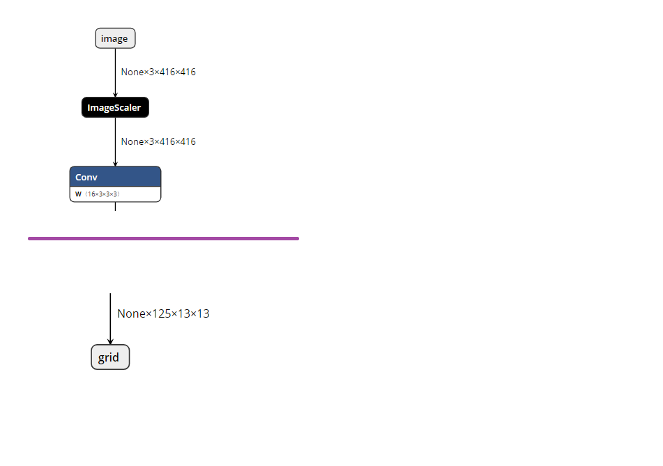

# 对象检测

| ML.NET 版本 | API 类型          | 状态                        | 应用程序类型    | 数据类型 | 场景            | 机器学习任务                   | 算法                  |
|----------------|-------------------|-------------------------------|-------------|-----------|---------------------|---------------------------|-----------------------------|
| v1.6.0           | 动态API | 最新 | 控制台应用程序 | 图像文件 | 对象检测 | 深度学习  | Tiny Yolo2 ONNX 模型 |


有关如何构建此应用程序的详细说明，请参阅Microsoft Docs网站上附带的[教程](https://docs.microsoft.com/en-us/dotnet/machine-learning/tutorials/object-detection-onnx)。

## 问题 
对象检测是计算机视觉中的一个经典问题：识别给定图像中的目标以及它们在图像中的位置。对于这些情况，您可以使用预先训练的模型，也可以训练自己的模型来对特定于自定义域的图像进行分类。

 
## 数据集
数据集包含位于[assets](./ObjectDetectionConsoleApp/assets/images)文件夹中的图像。这些图片来自[wikimedia commons网站](https://commons.wikimedia.org/wiki/Main_Page)。 转到[wikimediacomon.md]（./ObjectDetectionConsoleApp/assets/images/wikimedia.md）查看图像URL及其许可证。

## 预训练模型
有多个预先训练的模型来识别图像中的多个对象。这里我们使用的是预训练模型，**Tiny Yolo2**，格式为**ONNX**。该模型是一个用于对象检测的实时神经网络，可以检测20个不同的类别。它由9个卷积层和6个最大池层组成，是更复杂的full[YOLOv2]的较小版本(https://pjreddie.com/darknet/yolov2/)网络。

开放式神经网络交换即[ONNX](http://onnx.ai/)是一种表示深度学习模型的开放格式。使用ONNX，开发人员可以在最先进的工具之间移动模型，并选择最适合他们的组合。ONNX是由一个合作伙伴社区开发和支持的。

模型从[ONNX Model Zoo](https://github.com/onnx/models) 下载,这是一个预训练的，最先进的模型在ONNX格式的集合。

Tiny YOLO2模型是在[Pascal VOC](http://host.robots.ox.ac.uk/pascal/VOC/)数据集上训练的(http://host.robots.ox.ac.uk/pascal/VOC/)。以下是模型的先决条件。

**模型输入和输出**

**输入**

输入图像的大小 (3x416x416)  

**输出**

输出是一个(1x125x13x13)数组   

**预处理步骤**

将输入图像调整为float32类型的(3x416x416)数组。

**后处理步骤**

输出是一个（125x13x13）张量，其中13x13是图像被分割成的网格单元数。每个网格单元对应125个通道，由网格单元预测的5个边界框和描述每个边界框的25个数据元素（5x25=125）组成。有关如何导出最终边界框及其相应的置信度分数的更多信息，请参阅[文章](http://machinethink.net/blog/object-detection-with-yolo/)。


##  解决方案
控制台应用程序项目`ObjectDetection`可用于识别基于**Tiny Yolo2 ONNX**模型的示例图像中的对象。

同样，请注意，此示例仅使用/使用带有ML.NET API的预先训练的ONNX模型。因此，它**不**训练任何ML.NET模型。目前，ML.NET仅支持对现有ONNX训练模型进行评分/检测。

为了执行分类测试，您需要执行以下步骤：

1)  **设置VS默认启动项目：**在Visual Studio中将`ObjectDetection`设置为启动项目。
2)  **运行training model控制台应用程序：**在Visual Studio中按F5。在执行结束时，输出将类似于此屏幕截图：


##  代码演练
解决方案中有一个名为`ObjectDetection`的项目，负责以 Tiny Yolo2 ONNX格式加载模型，然后检测图像中的对象。

### ML.NET：模型评分

定义类中的数据架构，并在使用TextLoader加载数据时引用该类型。这里的类是**ImageNetData**。

```csharp
public class ImageNetData
{
    [LoadColumn(0)]
    public string ImagePath;

    [LoadColumn(1)]
    public string Label;

    public static IEnumerable<ImageNetData> ReadFromFile(string imageFolder)
    {
        return Directory
            .GetFiles(imageFolder)
            .Where(filePath => Path.GetExtension(filePath) != ".md")
            .Select(filePath => new ImageNetData { ImagePath = filePath, Label = Path.GetFileName(filePath) });
    }
}
```

### ML.NET:配置模型

第一步是创建一个空的数据视图，因为我们在配置模型时只需要数据模式。

```csharp
var data = mlContext.Data.LoadFromTextFile<ImageNetData>(imagesLocation, hasHeader: true);
```

用于加载图像的图像文件有两列：第一列定义为`ImagePath`，第二列定义为与图像对应的`Label`。

需要强调的是，在使用Tiny Yolo2 Onnx模型进行评分时，`ImageNetData`类中的`Label`并没有真正使用。仅在控制台上打印标签时使用。

第二步是定义评估器管道。通常，在处理深度神经网络时，必须使图像适应网络所期望的格式。这就是图像调整大小然后变换的原因（主要是在所有R、G、B通道中对像素值进行归一化）。

```csharp
var pipeline = mlContext.Transforms.LoadImages(outputColumnName: "image", imageFolder: "", inputColumnName: nameof(ImageNetData.ImagePath))
                .Append(mlContext.Transforms.ResizeImages(outputColumnName: "image", imageWidth: ImageNetSettings.imageWidth, imageHeight: ImageNetSettings.imageHeight, inputColumnName: "image"))
                .Append(mlContext.Transforms.ExtractPixels(outputColumnName: "image"))
                .Append(mlContext.Transforms.ApplyOnnxModel(modelFile: modelLocation, outputColumnNames: new[] { TinyYoloModelSettings.ModelOutput }, inputColumnNames: new[] { TinyYoloModelSettings.ModelInput }));
```

您还需要检查神经网络，并检查输入/输出节点的名称。为了检查模型，您可以使用[Netron](https://github.com/lutzroeder/netron)之类的工具，它与[Visual Studio Tools for AI](https://visualstudio.microsoft.com/downloads/ai-tools-vs/)一起自动安装。 
这些名称稍后将在评估管道的定义中使用：在初始网络的情况下，输入张量命名为“image”，输出命名为“grid”。

定义模型的**输入**和**输出**参数。

```csharp
public struct TinyYoloModelSettings
{
    // for checking TIny yolo2 Model input and  output  parameter names,
    //you can use tools like Netron, 
    // which is installed by Visual Studio AI Tools

    // input tensor name
    public const string ModelInput = "image";

    // output tensor name
    public const string ModelOutput = "grid";
}
```



最后，我们在*拟合*评估器管道之后返回训练模型。

```csharp
  var model = pipeline.Fit(data);
  return model;
```


# 检测图像中的对象:

在模型配置完成后，我们需要将图像传递给模型来检测对象。获取预测时，我们在属性`PredictedLabels`中获得一个浮点数组。该数组是一个浮点数组，大小为**21125**。如前所述，这是125x13x13的输出。此输出由“YoloOutputParser”类解释，并为每个图像返回多个边界框。再次过滤这些框，以便我们仅检索5个边界框，这些边界框对于图像的每个对象具有更好的可信度（一个框包含obejct的确定程度如何）。

```csharp
IEnumerable<float[]> probabilities = modelScorer.Score(imageDataView);

YoloOutputParser parser = new YoloOutputParser();

var boundingBoxes =
    probabilities
    .Select(probability => parser.ParseOutputs(probability))
    .Select(boxes => parser.FilterBoundingBoxes(boxes, 5, .5F));
```

**注意**与完整的Yolo2模型相比，Tiny Yolo2模型没有太多的精确度。由于这是一个示例程序，我们使用的是微型版本的Yolo模型，即Tiny_Yolo2


