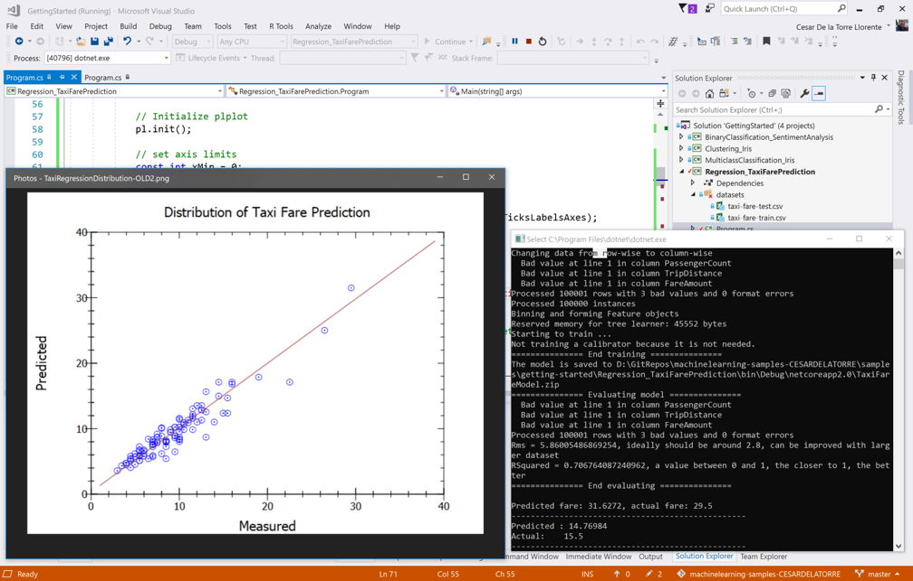

# 出租车费预测

| ML.NET 版本 | API 类型          | 状态                        | 应用程序类型    | 数据类型 | 场景            | 机器学习任务                   | 算法                  |
|----------------|-------------------|-------------------------------|-------------|-----------|---------------------|---------------------------|-----------------------------|
| v1.4           | 动态 API | 最新版本 | 控制台应用程序 | .csv 文件 | 价格预测 | 回归 | Sdca Regression |

在这个介绍性示例中，您将看到如何使用[ML.NET](https://www.microsoft.com/net/learn/apps/machine-learning-and-ai/ml-dotnet)预测出租车费。在机器学习领域，这种类型的预测被称为**回归**

## 问题
这个问题主要集中在预测纽约出租车的行程费用。从表面看，它似乎仅仅取决于行程的距离。但是，由于其他因素（比如额外的乘客或使用信用卡而非现金付款），纽约的出租车供应商收费不同。这种预测可用于出租车供应商向用户和司机提供乘车费用的估计。

为了解决这个问题，我们将使用下列输入建立一个ML模型:
* 供应商ID
* 费率代码
* 乘客数量
* 出行时间
* 出行距离
* 支付方式

并预测乘车的费用。

## ML 任务 - 回归
**回归**的广义问题是预测给定参数的某些连续值，例如：
* 根据房间的数量、位置、建造年份等预测房子的价格。
* 根据燃油类型和汽车参数预测汽车燃油消耗量。
* 预测基于问题属性来修复问题的时间估计。

所有这些示例的共同特征是我们想要预测的参数可以取特定范围内的任何数值。 换句话说，这个值用`integer`或`float`/`double`表示，而不是由`enum`或`boolean`类型表示。

## 解决方案
为了解决这个问题，首先我们将建立一个ML模型。然后，我们将在现有数据的基础上训练模型，评估其有多好，最后我们将使用该模型来预测出租车费。 


### 1. 建立模型

建立模型包括：上传数据（使用`TextLoader`加载`taxi-fare-train.csv`），对数据进行转换，以便ML算法（本例中为`StochasticDualCoordinateAscent`）能够有效地使用它：

```CSharp
//Create ML Context with seed for repeteable/deterministic results
MLContext mlContext = new MLContext(seed: 0);

// STEP 1: Common data loading configuration
IDataView baseTrainingDataView = mlContext.Data.LoadFromTextFile<TaxiTrip>(TrainDataPath, hasHeader: true, separatorChar: ',');
IDataView testDataView = mlContext.Data.LoadFromTextFile<TaxiTrip>(TestDataPath, hasHeader: true, separatorChar: ',');

//Sample code of removing extreme data like "outliers" for FareAmounts higher than $150 and lower than $1 which can be error-data 
var cnt = baseTrainingDataView.GetColumn<float>(nameof(TaxiTrip.FareAmount)).Count();
IDataView trainingDataView = mlContext.Data.FilterRowsByColumn(baseTrainingDataView, nameof(TaxiTrip.FareAmount), lowerBound: 1, upperBound: 150);
var cnt2 = trainingDataView.GetColumn<float>(nameof(TaxiTrip.FareAmount)).Count();

// STEP 2: Common data process configuration with pipeline data transformations
var dataProcessPipeline = mlContext.Transforms.CopyColumns(outputColumnName: "Label", inputColumnName: nameof(TaxiTrip.FareAmount))
                            .Append(mlContext.Transforms.Categorical.OneHotEncoding(outputColumnName: "VendorIdEncoded", inputColumnName: nameof(TaxiTrip.VendorId)))
                            .Append(mlContext.Transforms.Categorical.OneHotEncoding(outputColumnName: "RateCodeEncoded", inputColumnName: nameof(TaxiTrip.RateCode)))
                            .Append(mlContext.Transforms.Categorical.OneHotEncoding(outputColumnName: "PaymentTypeEncoded",inputColumnName: nameof(TaxiTrip.PaymentType)))
                            .Append(mlContext.Transforms.NormalizeMeanVariance(outputColumnName: nameof(TaxiTrip.PassengerCount)))
                            .Append(mlContext.Transforms.NormalizeMeanVariance(outputColumnName: nameof(TaxiTrip.TripTime)))
                            .Append(mlContext.Transforms.NormalizeMeanVariance(outputColumnName: nameof(TaxiTrip.TripDistance)))
                            .Append(mlContext.Transforms.Concatenate("Features", "VendorIdEncoded", "RateCodeEncoded", "PaymentTypeEncoded", nameof(TaxiTrip.PassengerCount)
                            , nameof(TaxiTrip.TripTime), nameof(TaxiTrip.TripDistance)));


// STEP 3: Set the training algorithm, then create and config the modelBuilder - Selected Trainer (SDCA Regression algorithm)                            
var trainer = mlContext.Regression.Trainers.Sdca(labelColumnName: "Label", featureColumnName: "Features");
var trainingPipeline = dataProcessPipeline.Append(trainer);
```

### 2. 训练模型
训练模型是在训练数据（具有已知的费用）上运行所选算法以调整模型参数的过程。 它在`Fit（）`API中实现。 要执行训练，我们只需在提供DataView时调用该方法。
```CSharp
var trainedModel = trainingPipeline.Fit(trainingDataView);
```
### 3. 评估模型
我们需要这一步来总结我们的模型对新数据的准确性。 为此，上一步中的模型针对另一个未在训练中使用的数据集运行（`taxi-fare-test.csv`）。 此数据集也包含已知的费用。 `Regression.Evaluate()`计算已知费用和模型预测的费用之间差异的各种指标。

```CSharp
IDataView predictions = trainedModel.Transform(testDataView);
var metrics = mlContext.Regression.Evaluate(predictions, labelColumnName: "Label", scoreColumnName: "Score");

Common.ConsoleHelper.PrintRegressionMetrics(trainer.ToString(), metrics);

```
>*要了解有关如何理解指标的更多信息，请查看[ML.NET指南](https://docs.microsoft.com/en-us/dotnet/machine-learning/)中的机器学习词汇表或使用任何有关数据科学和机器学习的材料*。

如果您对模型的质量不满意，可以采用多种方法对其进行改进，这些方法将在*examples*类别中介绍。

>*请记住，对于这个示例，其质量低于可能达到的水平，因为出于性能目的，数据集的大小已减小。您可以使用原始数据集来显著提高质量（原始数据集在数据集[README](../../../datasets/README.md)中引用）。*

### 4. 使用模型
在训练模型之后，我们可以使用`Predict()` API来预测指定行程的费用。

```CSharp
//Sample: 
//vendor_id,rate_code,passenger_count,trip_time_in_secs,trip_distance,payment_type,fare_amount
//VTS,1,1,1140,3.75,CRD,15.5

var taxiTripSample = new TaxiTrip()
{
    VendorId = "VTS",
    RateCode = "1",
    PassengerCount = 1,
    TripTime = 1140,
    TripDistance = 3.75f,
    PaymentType = "CRD",
    FareAmount = 0 // To predict. Actual/Observed = 15.5
};

ITransformer trainedModel;
using (var stream = new FileStream(ModelPath, FileMode.Open, FileAccess.Read, FileShare.Read))
{
    trainedModel = mlContext.Model.Load(stream, out var modelInputSchema);
}

// Create prediction engine related to the loaded trained model
var predEngine = mlContext.Model.CreatePredictionEngine<TaxiTrip, TaxiTripFarePrediction>(trainedModel);

//Score
var resultprediction = predEngine.Predict(taxiTripSample);

Console.WriteLine($"**********************************************************************");
Console.WriteLine($"Predicted fare: {resultprediction.FareAmount:0.####}, actual fare: 15.5");
Console.WriteLine($"**********************************************************************");

```

最后，您可以用方法`PlotRegressionChart()`在图表中展现测试预测的分布情况以及回归的执行方式，如下面的屏幕截图所示： 




