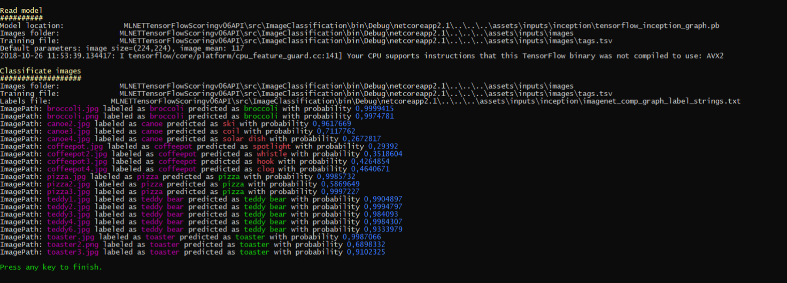
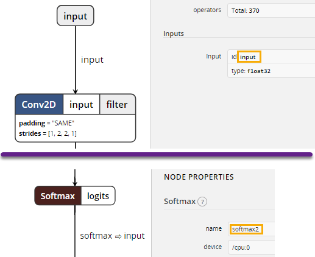

# Image Classification - Scoring sample

| ML.NET version | API type          | Status                        | App Type    | Data type | Scenario            | ML Task                   | Algorithms                  |
|----------------|-------------------|-------------------------------|-------------|-----------|---------------------|---------------------------|-----------------------------|
| v1.3.1  | Dynamic API | up-to-date | Console app | Images and text labels | Images classification | TensorFlow Inceptionv3  | DeepLearning model |


## Problem
Image classification is a common case in many business scenarios. For these cases, you can either use pre-trained models or train your own model to classify images specific to your custom domain. 

## DataSet
There are two data sources: the `tsv` file and the image files.  The [tsv file](./ImageClassification/assets/inputs/images/tags.tsv) contains two columns: the first one is defined as `ImagePath` and the second one is the `Label` corresponding to the image. As you can observe, the file does not have a header row, and looks like this:
```tsv
broccoli.jpg	broccoli
broccoli.png	broccoli
canoe2.jpg	canoe
canoe3.jpg	canoe
canoe4.jpg	canoe
coffeepot.jpg	coffeepot
coffeepot2.jpg	coffeepot
coffeepot3.jpg	coffeepot
coffeepot4.jpg	coffeepot
pizza.jpg	pizza
pizza2.jpg	pizza
pizza3.jpg	pizza
teddy1.jpg	teddy bear
teddy2.jpg	teddy bear
teddy3.jpg	teddy bear
teddy4.jpg	teddy bear
teddy6.jpg	teddy bear
toaster.jpg	toaster
toaster2.png	toaster
toaster3.jpg	toaster
```
The training and testing images are located in the assets folders. These images belong to Wikimedia Commons.
> *[Wikimedia Commons](https://commons.wikimedia.org/w/index.php?title=Main_Page&oldid=313158208), the free media repository.* Retrieved 10:48, October 17, 2018 from:  
> https://commons.wikimedia.org/wiki/Pizza  
> https://commons.wikimedia.org/wiki/Coffee_pot  
> https://commons.wikimedia.org/wiki/Toaster  
> https://commons.wikimedia.org/wiki/Category:Canoes  
> https://commons.wikimedia.org/wiki/Teddy_bear  

## Pre-trained model
There are multiple models which are pre-trained for classifying images. In this case, we will use a model based on an Inception topology, and trained with images from Image.Net. This model can be downloaded from https://storage.googleapis.com/download.tensorflow.org/models/inception5h.zip, but it's also available at `/ src / ImageClassification / assets /inputs / inception / tensorflow_inception_graph.pb`.

##  Solution
The console application project `ImageClassification.Score` can be used to classify sample images based on the pre-trained Inception-v3 TensorFlow model. 

Again, note that this sample only uses/consumes a pre-trained TensorFlow model with ML.NET API. Therefore, it does **not** train any ML.NET model. Currently, TensorFlow is only supported in ML.NET for scoring/predicting with existing TensorFlow trained models. 

You need to follow next steps in order to execute the classification test:

1) **Set VS default startup project:** Set `ImageClassification.Score` as starting project in Visual Studio.
2)  **Run the training model console app:** Hit F5 in Visual Studio. At the end of the execution, the output will be similar to this screenshot:



##  Code Walkthrough
There is a single project in the solution named `ImageClassification.Score`, which is responsible for loading the model in TensorFlow format, and then classify images.

### ML.NET: Model Scoring

Define the schema of data in a class type and refer that type while loading data using TextLoader. Here the class type is ImageNetData. 

```fsharp
[<CLIMutable>]
type ImageNetData = 
    {
        [<LoadColumn(0)>]
        ImagePath : string
        [<LoadColumn(1)>]
        Label : string
    }
```
The first step is to load the data using TextLoader

```fsharp
let data = mlContext.Data.ReadFromTextFile<ImageNetData>(dataLocation, hasHeader = false
```

The image file used to load images has two columns: the first one is defined as `ImagePath` and the second one is the `Label` corresponding to the image. 

It is important to highlight that the label in the `ImageNetData` class is not really used when scoring with the TensorFlow model. It is used when testing the predictions so you can compare the actual label of each sample data with the predicted label provided by the TensorFlow model. 

```csv
broccoli.jpg	broccoli
bucket.png	bucket
canoe.jpg	canoe
snail.jpg	snail
teddy1.jpg	teddy bear
```
As you can observe, the file does not have a header row.

The second step is to define the estimator pipeline. Usually, when dealing with deep neural networks, you must adapt the images to the format expected by the network. This is the reason images are resized and then transformed (mainly, pixel values are normalized across all R,G,B channels).

```fsharp
let pipeline =
	EstimatorChain()
		.Append(mlContext.Transforms.LoadImages(imageFolder = imagesFolder, columns = [|struct("ImageReal", "ImagePath")|]))
		.Append(mlContext.Transforms.Resize("ImageReal", imageWidth, imageHeight, inputColumnName = "ImageReal"))
		.Append(mlContext.Transforms.ExtractPixels([| ImagePixelExtractorTransformer.ColumnInfo("input", "ImageReal", interleave = channelsLast, offset = float32 mean) |]))
		.Append(mlContext.Transforms.ScoreTensorFlowModel(inputModelLocation, [| "softmax2" |], [| "input" |]))
```
You also need to check the neural network, and check the names of the input / output nodes. In order to inspect the model, you can use tools like [Netron](https://github.com/lutzroeder/netron), which is automatically installed with [Visual Studio Tools for AI](https://visualstudio.microsoft.com/downloads/ai-tools-vs/). 
These names are used later in the definition of the estimation pipe: in the case of the inception network, the input tensor is named 'input' and the output is named 'softmax2'



Finally, we extract the prediction engine after *fitting* the estimator pipeline. The prediction engine receives as parameter an object of type `ImageNetData` (containing 2 properties: `ImagePath` and `Label`), and then returns and object of type `ImagePrediction`.  

```fsharp
let model = pipeline.Fit(data)
let predictionEngine = mlContext.Model.CreatePredictionEngine<ImageNetData, ImageNetPrediction>(model)
```
When obtaining the prediction, we get an array of floats in the property `PredictedLabels`. Each position in the array is assigned to a label, so for example, if the model has 5 different labels, the array will be length = 5. Each position in the array represents the label's probability in that position; the sum of all array values (probabilities) is equal to one. Then, you need to select the biggest value (probability), and check which is the assigned label to that position.

### Citation
Training and prediction images 
> *Wikimedia Commons, the free media repository.* Retrieved 10:48, October 17, 2018 from https://commons.wikimedia.org/w/index.php?title=Main_Page&oldid=313158208.
